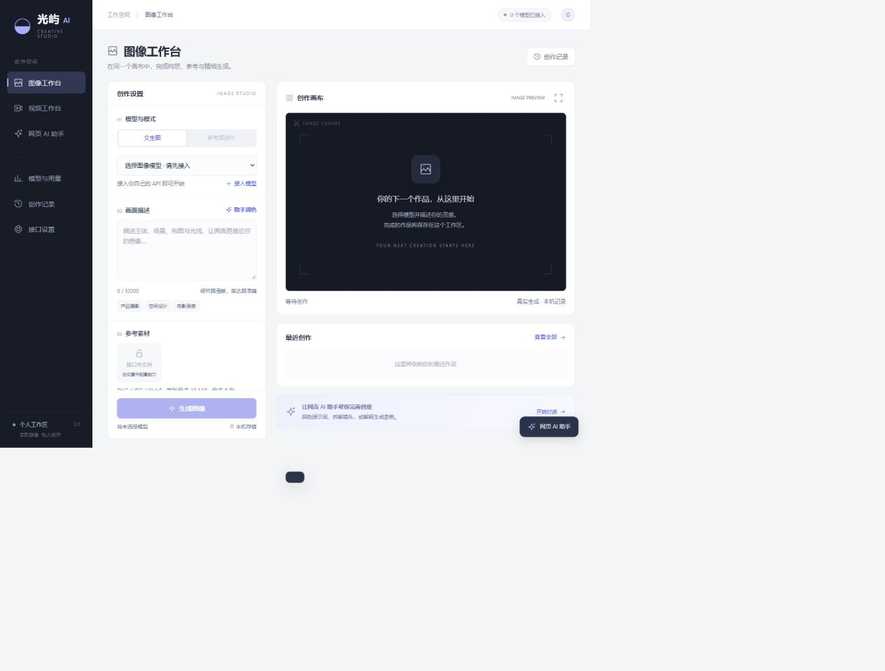
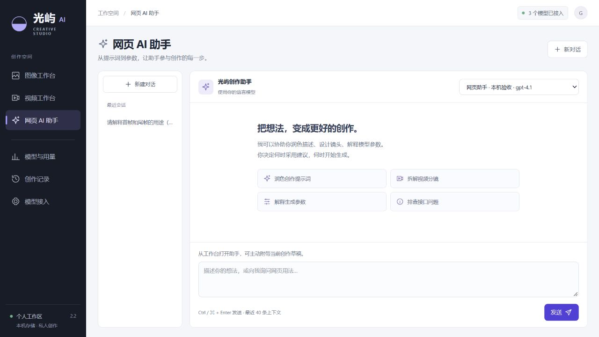
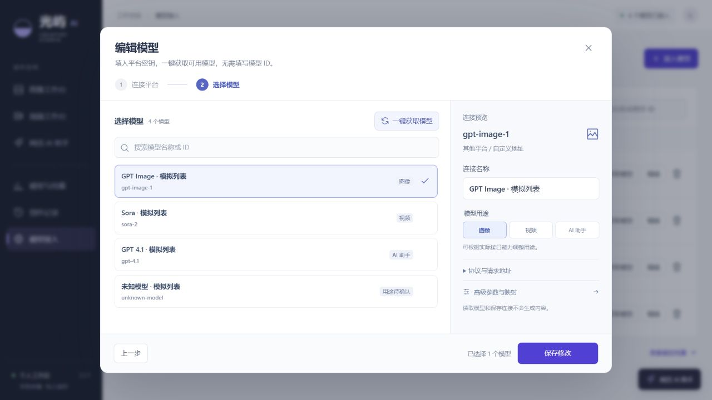
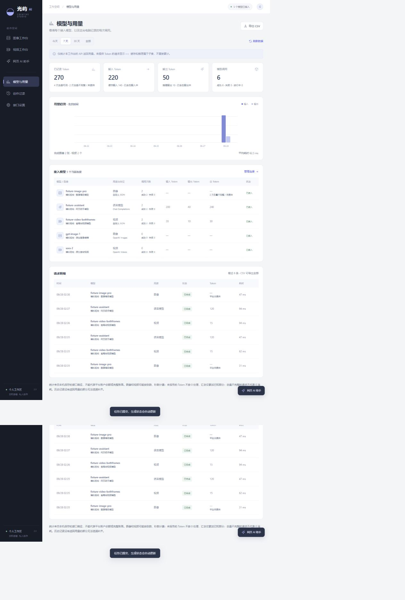

# 光屿 AI · Guangyu AI

**在自己的电脑上连接模型 API，完成图像、视频创作和 AI 答疑。**

光屿 AI 是一个面向个人使用的中文创作工作台。支持多个模型连接、参考图、视频首尾帧、网页 AI 助手和本机用量统计。界面在浏览器中打开，连接与创作记录保存在电脑上。

[下载 Windows 版本](https://github.com/zhao770943-byte/guangyu-ai/releases/latest) · [使用说明](使用说明.md) · [接口接入](docs/providers.md) · [提交问题](https://github.com/zhao770943-byte/guangyu-ai/issues)



## Windows 一键使用

1. 打开 [Releases](https://github.com/zhao770943-byte/guangyu-ai/releases)，下载对应版本的 `GuangyuAI-v版本号-windows-x64.zip`。请下载这个应用包，GitHub 自动生成的 `Source code` 是开发源码。
2. **完整解压**到有写入权限的文件夹，例如自己的“文档”目录。保留 `GuangyuAI.exe` 旁的 `_internal` 文件夹。
3. 双击 `GuangyuAI.exe`，浏览器会打开 [本机工作台](http://127.0.0.1:8786/)。无需安装 Python、Node.js 或数据库。
4. 进入“模型接入 → 接入模型”。第一步“连接平台”：选择平台，填写自己的 API Key，核对自动填入的 API 基础地址，再点击“一键获取模型”。
5. 第二步“选择模型”：在平台返回的列表中搜索并选择模型，无需填写模型 ID。预览中会填入连接名称，并匹配已识别的用途与协议；未知模型需主动确认用途，核对后点击“接入所选模型”。

没有 API Key 时，选择平台后可点击“获取 API Key”在新标签页打开官方入口；Ollama 与 LM Studio 显示本机服务下载入口。应用不代为申请密钥或购买额度。

目前提供 **Windows x64** 版本。应用免费开源，模型服务可能按平台规则收费；安装包不提供共享密钥或模型额度。外部模型需要联网，本机模型连接除外。

程序尚未进行代码签名。下载后可比对同一 Release 中的 SHA-256 校验文件；若 Windows 或安全软件阻止运行，请先核对来源和提示，也可以选择源码运行，不必关闭安全防护。

关闭浏览器后后台服务仍运行。等待任务结束后，双击 `停止光屿AI.cmd`，或在应用目录运行：

```powershell
.\GuangyuAI.exe --stop
```

## 可以做什么

| 工作区 | 功能 |
| --- | --- |
| 图像工作台 | 文生图、最多 8 张参考图、模型允许的尺寸／质量／张数／种子等参数、作品预览与复用 |
| 视频工作台 | 文生视频、首帧和首尾帧输入、异步任务查询、播放、继续查询原任务 |
| 网页 AI 助手 | 完整对话页与侧栏、提示词润色、分镜建议、主动采纳到创作草稿 |
| 模型与用量 | 已配置模型、历史模型、调用与成品数量、接口返回的 Token、耗时、趋势和 CSV |
| 创作记录 | 查看任务状态、结果和参数，复用已有创作 |
| 模型接入 | 表格管理与用途筛选、实际两步向导、14 个平台预设、一键获取模型、列表搜索与选择、高级映射 |

桌面工作台将参数区和预览区分别滚动，生成按钮保留在参数区底部。导航、标题和列表采用更紧凑的间距；长参数和较多模型不会把主要操作挤出视野。窄屏改为顺序布局，保留生成与接入的主操作入口。



## 接口兼容范围

内置 OpenAI Images、Videos、Chat Completions、Responses，Anthropic Messages，以及 Gemini generateContent；还可配置 POST JSON 与 GET 轮询的自定义协议。

模型平台预设覆盖 OpenAI、Anthropic、Gemini、DeepSeek、硅基流动、Kimi、OpenRouter、xAI、Ollama、LM Studio、百炼、智谱、MiniMax 和火山方舟。所有预设都可点击“一键获取模型”，按当前地址实际请求模型目录；其他兼容服务也可使用自定义地址和列表路径。平台是否提供目录以实际响应为准。选中已识别模型后会匹配用途与协议；未知模型必须选择实际用途后才能保存。“协议与请求地址”和高级参数默认收起，可按需展开检查。

点击“一键获取模型”才会向你选择的地址发送模型列表 GET，不生成内容，保存连接前也不持久化新输入密钥。失败或返回空列表时会显示原因，可核对地址、密钥权限和目录设置后重试；新连接只从返回的列表选择模型。编辑已有连接时可保留原模型。切换平台或修改基础地址会清空输入密钥，防止误发到其他服务。列表读取成功不等于模型已经通过真实生成验证。



上图为本机模拟模型目录，展示读取、搜索与选择流程；不代表真实供应商的账号权限或模型清单。

**“接入不同 API”通过协议适配和字段映射实现，不保证任意平台填入地址即可使用。** 专有签名、SDK、多个认证头、WebSocket、分阶段上传等需要增加适配器。模型名称、权限和参数范围以你所使用的平台为准。

高级控件按连接能力启用。当前 OpenAI Videos 适配支持首帧，首尾帧模式需要使用确实支持尾帧的自定义接口；工作台不会把未支持的参数静默丢弃。具体能力、模板与限制见 [接口接入指南](docs/providers.md)。

常用平台 API 前缀、模型列表端点与目录限制见 [平台地址目录](docs/provider-catalog.md)，每项附官方文档依据。地区、套餐和代理服务可能使用不同地址，请按自己的账号核对。

## 数据与用量

默认只监听 `127.0.0.1:8786`。数据保存在应用目录的 `data/`，API Key 由当前 Windows 用户的 DPAPI 加密。密钥不回传前端；提示词、选中素材与必要上下文会在主动发送或生成时传给所选模型平台。

用量页统计**本应用保存的请求及平台返回用量**，不是平台账户账单或余额。未返回 Token 时显示 `—`，缓存与推理 Token 不重复加入总量。图像和视频可能使用张数或时长计费，不能仅靠 Token 推算费用。



上图使用隔离模拟接口展示统计能力，模型名称和数值不是预装连接、真实账单或运行效果承诺。

备份、升级和迁移请看 [数据与维护](docs/data-and-upgrades.md)。不要将自己的 `data/`、API Key、日志或私人素材提交到 GitHub。

## 从源码运行

需要 Windows、Python 3.11 或以上版本。API Key 存储依赖 Windows DPAPI，当前不提供 macOS/Linux 运行支持。

```powershell
git clone https://github.com/zhao770943-byte/guangyu-ai.git
cd guangyu-ai
py -3 -m venv .venv
.\.venv\Scripts\python.exe -m pip install -r requirements.txt
.\.venv\Scripts\python.exe launcher.py
```

停止服务：

```powershell
.\.venv\Scripts\python.exe launcher.py --stop
```

上传图片使用 `Pillow==12.3.0`；前端为原生 HTML/CSS/JavaScript，没有 npm 构建步骤。源代码测试、Windows 打包见 [开发与构建](docs/development.md)。

## 项目文档

- [完整使用说明](使用说明.md)
- [架构与接入设计](设计与接入方案.md)
- [验证范围与复现](验收记录.md)
- [更新记录](CHANGELOG.md)
- [贡献指南](CONTRIBUTING.md) · [安全说明](SECURITY.md)

## License

[MIT](LICENSE) © 2026 zhao770943-byte。第三方依赖遵循各自许可证；模型服务的条款、内容政策和费用由对应平台决定。
